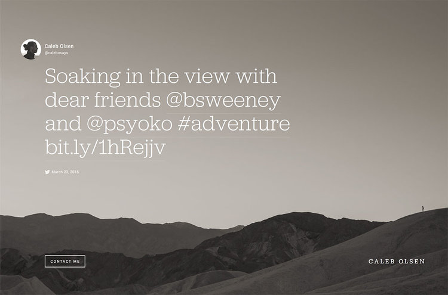

# Bluesky Cover Page 🦋

## I have had to rebuild this repo 4 times because of Git drama. The terrors persist, but so do I!

A page that shows my latest Bluesky post using AT Protocol. Inspired by old-school Squarespace cover pages. I remember loving this cover page, and it went out of style so fast. I really want to achieve this using Bluesky! Stick around for the finished product.

## tiny tech stack + tools

